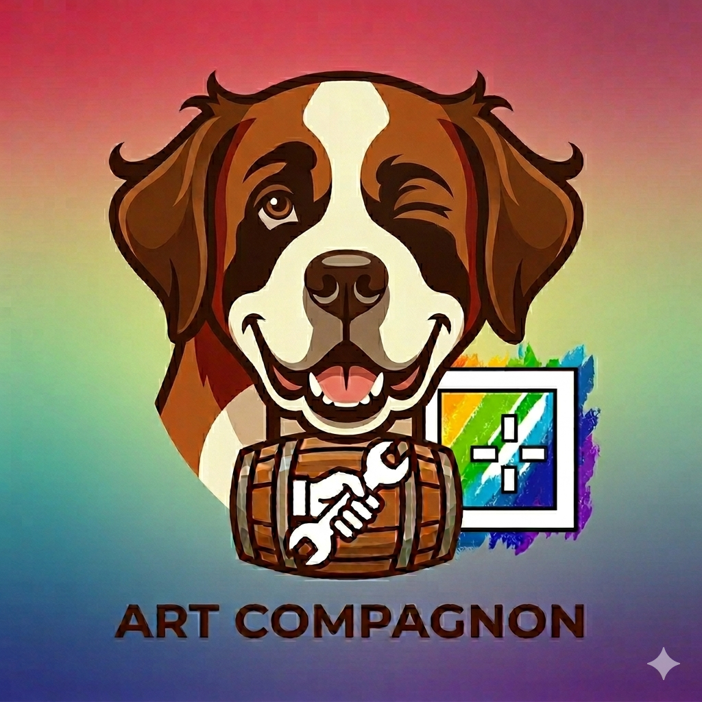

<div align="center">
  
</div>

# 🎨 Le ARTherapee Compagnon

Lanceur de scripts et d'éditeurs externes pour **ART**. Il s'ouvre depuis ART en
éditeur externe et lance vos scripts **bash / python / lua / CTL** sur vos photos.

## 🌟 Caractéristiques
- 🔧 Scripts multi-langages (Bash, Python, Lua, CTL)
- 📋 Éditeurs externes (GIMP, Krita, RawTherapee, Hugin…)
- 📂 Arborescence par type · 📸 multi-fichiers · 🌙 thèmes · 🇫🇷 🇬🇧 FR/EN
- 📦 Packs de scripts en un clic

## 📦 Installation

```bash
git clone https://github.com/carafife/ARTcompagnon.git
cd ARTcompagnon
./demarrer.sh
```

`demarrer.sh` ouvre une fenêtre qui vous guide, en **2 étapes** :

1. **Installer ART** (`installer-art.sh`) — télécharge le **bundle officiel d'ART**,
   qui inclut **déjà le CTL et l'OCIO** (nécessaires à la simulation de film).
   *Si vous avez déjà un ART complet, il le détecte et ne touche à rien.*
2. **Installer le Compagnon** (`install.sh`).

*(Ou à la main : `./installer-art.sh` puis `./install.sh`.)*

Ensuite : lancez **ART** → dans le Compagnon, onglet **Scripts ART** →
**« Installer Pack »** pour récupérer la collection de scripts.

## 🎯 Utilisation
- Depuis ART : **Éditeur externe** (ou clic droit dans le navigateur) →
  **Le ARTherapee Compagnon**.
- Onglet **Scripts ART** → choisir un script → **Exécuter**.

## ⚙️ CTL / simulation de film
Le bundle officiel d'ART inclut déjà le **CTL + OCIO**. Après l'installation,
réglez le **« Dossier CLUT »** sur `~/.config/ART/ctlscripts`
(Préférences → Traitement de l'image) puis **redémarrez ART**.
Voir la fiche **« Vérifier le support CTL »** (dans le centre d'aide du Compagnon).

## 🔄 Mise à jour
- **ART** : relancez `./installer-art.sh` (il prend la dernière version).
- **Le Compagnon** : `git pull` dans le dossier cloné, puis relancez `./install.sh`.

## 📚 Documentation
- [INSTALLATION.md](INSTALLATION.md) — installation détaillée & dépannage

## 📝 Licence
MIT — Créé avec ❤️ par carafife
